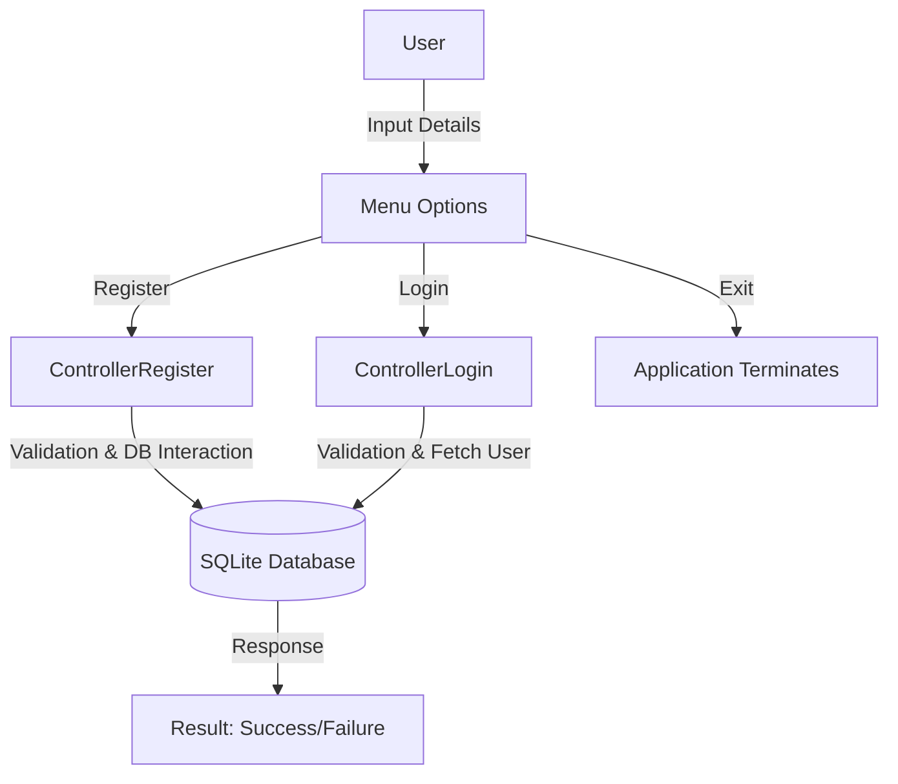

# Login-System 🚀  
A simple, yet powerful Python-based login system leveraging SQLite and SQLAlchemy for secure user authentication and registration.  

---

## 🌟 **Overview**
The `Login-System` provides a robust framework for managing user credentials and securely handling login and registration functionalities. It’s ideal for integrating into Python-based applications that require basic user authentication.  

### 🛠️ **Key Features**
- **SQLite Database:** Lightweight and built-in database support.  
- **SQLAlchemy ORM:** Simplifies database interactions.  
- **Comprehensive Error Handling:** Validates user inputs with clear feedback.  
- **Scalable Design:** Modular and extendable for future enhancements.  

---

## 📊 **System Architecture**  
Here’s a high-level overview of how the system works:  



---

## ⚙️ **Installation & Usage**  

### **Prerequisites**
- Python 3.8+
- Virtual environment (recommended)

### **Setup Instructions**
1. **Clone the Repository**  
   ```bash
   git clone https://github.com/Caio-Felice-Cunha/Login-System.git
   cd Login-System
   ```

2. **Set Up Virtual Environment**  
   ```bash
   python -m venv venv
   source venv/bin/activate  # For Linux/macOS
   venv\Scripts\activate     # For Windows
   ```

3. **Install Dependencies**  
   ```bash
   pip install -r requirements.txt
   ```

4. **Run the Application**  
   ```bash
   python view.py
   ```

### **Usage**  
1. Choose an option from the menu:  
   - **1:** Register a new user.  
   - **2:** Login with existing credentials.  
   - **3:** Exit the application.  
2. Follow the prompts for input, and the system will handle validation and database interactions.

---

## 🤝 **Contributing**  

Contributions are welcome! Follow these steps to contribute:  

### **Development Environment Setup**  
1. **Fork the Repository**  
   Navigate to [Login-System](https://github.com/Caio-Felice-Cunha/Login-System) and click `Fork`.  

2. **Clone Your Fork**  
   ```bash
   git clone https://github.com/<your-username>/Login-System.git
   cd Login-System
   ```

3. **Install Dependencies**  
   Follow the [setup instructions](#setup-instructions).  

4. **Make Changes**  
   - Follow the existing code style.  
   - Add relevant comments and tests for your changes.  

5. **Submit a Pull Request**  
   - Push your changes to your fork:  
     ```bash
     git push origin <branch-name>
     ```
   - Create a pull request via GitHub.  

---

## 🐛 **Known Issues**  
- Input validation could be enhanced for stronger password policies.  
- Currently lacks robust encryption for storing passwords.  

---

## 🚀 **Future Plans**  
- Implement password hashing using libraries like `bcrypt`.  
- Add support for multi-factor authentication (MFA).  
- Create a web-based interface for the system.  

---

## 📜 **License**  
This project is licensed under the MIT License. See the [LICENSE](LICENSE) file for details.  

---

💡 **Acknowledgments**  
Special thanks to the open-source community for providing the tools and libraries that made this project possible!  

## ⚖️ Credits

This project was developed as part of the "4 Days 4 Projects" initiative by [Pythonando](https://pythonando.com.br) on YouTube.

---

🎉 **Happy Coding!** 